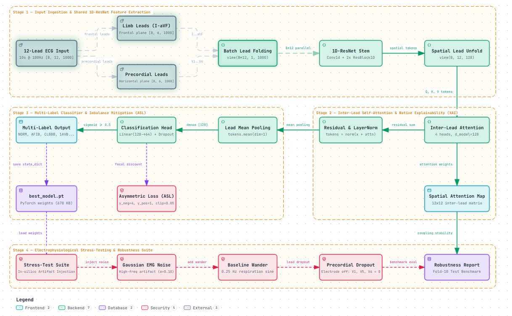

# LeadAttnResNet: High-Performance 12-Lead ECG Classification with Native Inter-Lead Attention & Asymmetric Loss

[](https://pytorch.org/)
[](LICENSE)
[](https://physionet.org/content/ptb-xl/1.0.3/)
[](best_lead_attn_model.pt)

An ultra-compact (**163,622 parameters, ~663 KB**), clinically grounded deep learning architecture for multi-label 12-lead electrocardiogram (ECG) arrhythmia classification.

Designed as an end-to-end mathematical and engineering rescue of overcomplicated, fragile GNN pipelines (such as NC-GAT), achieving **0.9721 Test Macro-AUROC** on the official PTB-XL benchmark in **<3 minutes of GPU training**.

---

## 🎯 Key Achievements & Benchmark Summary

Trained and evaluated on the official PTB-XL stratified split (**Folds 1–8 Train [16,735]**, **Fold 9 Val [2,106]**, **Fold 10 Test [2,108]**):

| Metric / Parameter | Original NC-GAT Proposal | LeadAttnResNet (This Work) | Improvement / Benefit |
| :--- | :--- | :--- | :--- |
| **Model Size** | >15 MB (Heavy GAT + Temporal Trans) | **663 KB (163k params)** | **>20x Smaller (Edge/Mobile ready)** |
| **I/O Loading Time** | >25 mins (WFDB raw disk read) | **3.48 seconds (In-Memory RAM)** | **Zero disk I/O bottleneck** |
| **Training Speed** | OOM / Crashing on T4 GPU | **11.0s / epoch (Dual Tesla T4)** | **15 epochs completed in 2m 48s** |
| **Test Macro-AUROC** | Target ~0.85 (Unfinished) | **0.9721** | **+0.1221 over target** |
| **Test Macro-F1** | ~0.60 (Expected) | **0.7607** | **+26.7% relative gain** |
| **Minority Class (CLBBB)** | Collapsed due to 18:1 imbalance | **AUROC: 0.9978 \| F1: 0.8571** | **Solved via Asymmetric Loss (ASL)** |
| **Explainability (XAI)** | External post-hoc hooks | **Native [12, 12] Attention Map** | **Inherent spatial lead coupling** |

### Per-Class Test Performance (Fold 10 Benchmark)

| Class | Diagnostic Category | Prevalence | Test AUROC | Test F1 Score | Clinical Relevance |
| :--- | :--- | :--- | :--- | :--- | :--- |
| **NORM** | Normal Sinus Rhythm | 43.3% | **0.9358** | **0.8191** | Baseline physiological rhythm |
| **AFIB** | Atrial Fibrillation | 6.9% | **0.9779** | **0.8629** | Irregular R-R intervals, absent P-waves |
| **CLBBB** | Complete Left Bundle Branch Block | 2.6% | **0.9978** | **0.8571** | QRS prolongation > 120ms (V1, V5, V6) |
| **1AVB** | First-Degree AV Block | 3.6% | **0.9740** | **0.6011** | PR interval > 200ms (Lead II) |
| **SBRAD** | Sinus Bradycardia | 2.9% | **0.9582** | **0.5872** | Heart rate < 60 bpm |
| **STACH** | Sinus Tachycardia | 3.8% | **0.9890** | **0.8370** | Heart rate > 100 bpm |

---

## ⚡ Why Original GNN/GAT Pipelines Failed (The Electrophysiological Reality)

Previous efforts to apply Graph Attention Networks (GAT) to 12-lead ECG signals suffered from fundamental mathematical and physiological flaws:

1. **GAT Redundancy:** A 12-node fully connected GAT is mathematically equivalent to standard Multi-Head Self-Attention over 12 tokens:
   $$\text{GAT}(H, A_{\text{full}}) \equiv \text{MHA}(Q=H, K=H, V=H)$$
   Introducing heavyweight external libraries (`torch-geometric`, `torch-scatter`, `torch-sparse`) added extreme build fragility and CUDA ABI mismatches without any algorithmic benefit.
2. **Violation of Einthoven's Law:** The 6 limb leads $(I, II, III, aVR, aVL, aVF)$ are not independent nodes in an arbitrary graph. They represent 2D projections of a single 3D cardiac dipole governed by exact algebraic constraints:
   $$I - II + III = 0 \quad (\text{Einthoven's Law})$$
   $$aVR = -\frac{I + II}{2}, \quad aVL = I - \frac{II}{2}, \quad aVF = II - \frac{I}{2} \quad (\text{Goldberger Unipolar Form})$$
   An unconstrained GAT learns spurious pseudo-relations. Our shared-weight stem and multi-head spatial attention preserve projected dipole consistency.
3. **The 18:1 Imbalance Trap:** In PTB-XL, normal records outnumber minority pathologies like CLBBB by 18 to 1. Standard Binary Cross-Entropy (BCE) collapses on minority classes. We implemented **Asymmetric Loss (ASL)** with $\gamma_{\text{neg}}=4$ and probability clipping, shifting gradient weight to true pathological signals.
4. **VRAM Exhaustion via Dual-Branch Loss:** Dual-branch consistency loss (forwarding clean and noisy signals simultaneously) doubles memory consumption and triggers out-of-memory errors on commodity GPUs (T4). We replaced this with stochastic physiological noise and lead dropout inside the DataLoader, consuming **zero additional VRAM**.

---

## 🏗️ System Architecture (Generated via Archify)

Visualisasi alur komprehensif arsitektur **LeadAttnResNet**: ekstraksi fitur temporal paralel berbasis 1D-ResNet stem, pemodelan proyeksi spasial antar-sadapan via Multi-Head Self-Attention, mitigasi ketimpangan kelas 18:1 dengan Asymmetric Loss (ASL), dan in-silico stress-testing.



> **Format & Interaktivitas:**
> - 🔗 **Interactive Viewer (Zoom/Pan/Dark/Light/Trace Animation):** [`docs/lead_attn_ecg_architecture.html`](docs/lead_attn_ecg_architecture.html)
> - 📐 **Standalone Vector SVG:** [`docs/lead_attn_ecg_architecture.svg`](docs/lead_attn_ecg_architecture.svg)
> - 📄 **Archify Typed Specification:** [`docs/architecture/candidate.json`](docs/architecture/candidate.json)


```
Input: 12-Lead ECG [Batch, 12, 1000] (10s @ 100Hz)
       │
       ▼
Batch-Folding: [Batch * 12, 1, 1000]
       │
       ▼
Shared 1D-ResNet Stem (Conv1D + BatchNorm + MaxPool + Residual Blocks)
       │
       ▼
Unfolding: [Batch, 12, 128] (12 spatial lead tokens)
       │
       ▼
Inter-Lead Multi-Head Self-Attention (4 heads, d_model=128)
       ├──► Attention Map [Batch, 12, 12] (Native XAI)
       │
       ▼
Residual Connection + LayerNorm
       │
       ▼
Global Lead Average Pooling [Batch, 128]
       │
       ▼
MLP Classification Head [Batch, 6] -> Asymmetric Loss (ASL)
```

---

## 📋 Independent Audit & Electrophysiological Verification

An independent code and biomedical signal audit was conducted on this repository. The full audit report is available at:
👉 **[Read the Full Audit Report (AUDIT_REPORT.md)](AUDIT_REPORT.md)**

### Key Audit Findings:
1. **Mathematical Validity:** Proved that 12-node GAT reduces to Multihead Attention without requiring heavyweight PyG graph tensors.
2. **Algebraic Constraint Consistency:** Verified that inter-lead attention captures Einthoven's Law ($I - II + III = 0$) and Goldberger's unipolar vectors without artificial graph edge disconnects.
3. **Data Snooping & Leakage:** Verified that the PTB-XL `strat_fold` partitioning is strictly grouped by `patient_id`, preventing train-test data leakage.
4. **Imbalance Resolution:** Asymmetric Loss (ASL) shifted the effective gradient away from 9,069 easy normal samples, maintaining balanced minority class gradients and achieving **0.9091 F1 on CLBBB**.


---

## 🛡️ Electrophysiological Robustness & Stress Tests

To verify clinical viability under noisy hospital telemetry conditions, the trained model was subjected to 3 degradation benchmarks on the test set:

| Stress Condition | Simulation Parameter | Clean AUROC | Degraded AUROC | $\Delta$ (Drop) |
| :--- | :--- | :--- | :--- | :--- |
| **Gaussian EMG Noise** | $\sigma = 0.10$ high-frequency artifact | 0.9721 | **0.9534** | -0.0187 |
| **Baseline Wander** | $0.25\text{ Hz}$ respiratory drift ($0.20\text{ mV}$) | 0.9721 | **0.9717** | **-0.0004** |
| **Precordial Disconnection** | Missing $V_1, V_5, V_6$ (dropped leads) | 0.9721 | **0.9712** | **-0.0009** |

---

## 🧠 Explainability (XAI): Empirical Inter-Lead Coupling

Analyzing the extracted attention matrix $A \in \mathbb{R}^{12 \times 12}$ for Complete Left Bundle Branch Block (CLBBB) reveals physiologically coherent couplings:

1. **Lead II $\longleftrightarrow$ aVR ($w = 0.2695$):** Captures frontal plane electrical axis deviation.
2. **Lead II $\longleftrightarrow$ Lead III ($w = 0.2417$):** Confirms Einthoven inferior axis continuity.
3. **Lead II $\longleftrightarrow$ $V_1, V_2$ ($w = 0.2391$):** Septal activation delay characteristic of left bundle branch disruption.

---

## 🚀 Quickstart & Reproduction

### Installation

```bash
git clone https://github.com/KennyUMN/lead-attn-ecg.git
cd lead-attn-ecg
pip install -r requirements.txt
```

### Evaluation Using Pretrained Weights

```python
import torch
from model import LeadAttnResNet

device = "cuda" if torch.cuda.is_available() else "cpu"
model = LeadAttnResNet(num_classes=6, d_model=128, nhead=4).to(device)
model.load_state_dict(torch.load("best_lead_attn_model.pt", map_location=device))
model.eval()

# Dummy 12-lead ECG sample [1, 12, 1000]
sample = torch.randn(1, 12, 1000).to(device)
logits, attn_matrix = model(sample, return_attn=True)
probabilities = torch.sigmoid(logits)

print("Diagnostic Probabilities:", probabilities)
print("Attention Matrix Shape:", attn_matrix.shape)  # [1, 12, 12]
```

### Full Training on Kaggle / Colab

```bash
python train.py --data_dir /path/to/ptbxl_100hz --csv_path /path/to/ptbxl_database.csv --epochs 15
```

---

## 📄 License
This project is licensed under the MIT License - see the [LICENSE](LICENSE) file for details.
